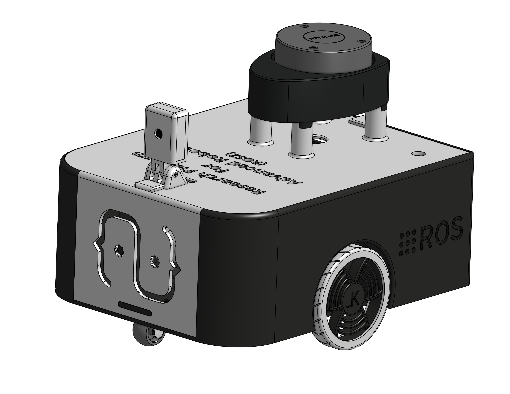

  <picture>
    <source srcset="./docs/white_and_blue_logo.svg" media="(prefers-color-scheme: dark)" width="300">
    <source srcset="./docs/black_and_blue_logo.svg" media="(prefers-color-scheme: light)" width="300">
    
  </picture>

 

<strong>ReVolt</strong> is a test differential drive robot designed for research and development.
It is fully integrated with ROS 2 and it is a great base platform for my continuous learning and development in the field of mobile robotics.

  

